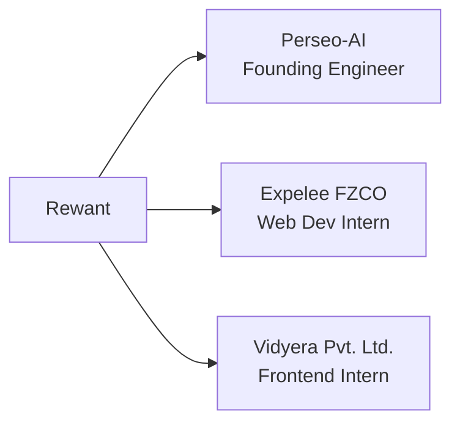
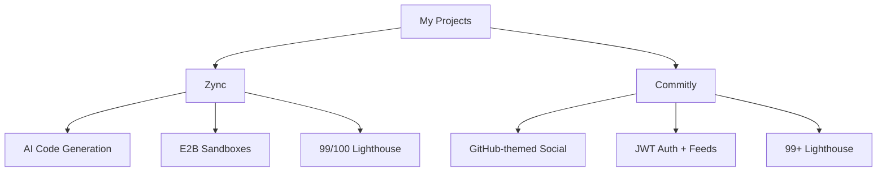

<div align="center">
  
</div>

<div align="center">
  <a href="#">
    
  </a>
</div>

<br/>

<div align="center">

  
  [](https://github.com/Rewant-1)

</div>

---

## 👋 About Me

```ts
const rewant = {
  degree:     "B.Tech ECE (Minor: CS) @ University of Delhi '27",
  role:       "Frontend Developer & Full-Stack Builder",
  location:   "Delhi, India 🇮🇳",
  focus:      ["React", "Next.js", "TypeScript", "AI-powered apps"],
  building:   "Scalable, performant, and accessible web experiences",
  achievements: ["SIH'25 Finalist", "Smart Delhi Ideathon Top 10 / 1500+ teams"],
  funFact:    "I benchmark everything with Autocannon before shipping 🚀",
};
```

- 🔭 Currently building **[Zync](https://zync-ashen.vercel.app/)** — AI platform that generates full React apps from a prompt
- 🌱 Exploring **tRPC, job orchestration (Inngest), and sandboxed code execution (E2B)**
- 🤝 Open to **collaborating** on interesting open source projects
- 💬 Ask me about **React, Next.js, Tailwind, or full-stack architecture**
- 📫 Reach me: [rewant.bhriguvanshi@gmail.com](mailto:rewant.bhriguvanshi@gmail.com)
- 🌐 Portfolio: [rewant.dev](https://rewant.dev)

---

## 💼 Experience

<details open>
<summary><strong>Click to expand</strong></summary>

<br/>



**🏗️ Founding Engineer — Perseo-AI** *(Oct 2025 – Dec 2025 · Delhi, Remote)*
- Architected a full-stack AI assistant platform with modular service architecture (Gmail, Calendar, AI, User services)
- Implemented secure OAuth 2.0 via Clerk + Composio with 15+ RESTful API endpoints
- Set up Jest testing suite, custom middleware stack, and comprehensive API documentation

**🌐 Web Developer Intern — Expelee FZCO** *(Sep 2025 – Oct 2025 · Dubai, Remote)*
- Shipped 8+ client-specific templates within strict 2–3 week deadlines with 100% brand alignment

**🎨 Frontend Intern — Vidyera Pvt. Ltd.** *(Feb 2026 – Apr 2026 · Nagpur, Remote)*
- Redesigned the full frontend of **StudyNode** edtech platform with 100% accessibility, and built screens for admin, teacher, and student roles

</details>

---

## 🚀 Projects

<details open>
<summary><strong>Featured Work</strong></summary>

<br/>



<br/>

| 🔗 Project | 📖 Description | Stack |
|------------|----------------|-------|
| [**Zync**](https://github.com/Rewant-1/zync) · [Live](https://zync-ashen.vercel.app/) | Full-stack AI platform that generates multi-file React apps (4+ files, 150+ LOC/prompt) with live E2B sandbox preview, rollback system, and Inngest job orchestration. **99/100 Lighthouse, 75 req/s** | `Next.js 15` `React 19` `tRPC` `Prisma` `PostgreSQL` `E2B` `Tailwind` |
| [**Commitly**](https://github.com/Rewant-1/commitly) · [Live](https://commitly-152b.onrender.com/) | GitHub/terminal-themed developer social app with JWT auth, nested comments, likes, bookmarks, reposts, and optimistic UI. **99+ Lighthouse, 78 req/s** | `React` `TanStack Query` `Express` `MongoDB` `JWT` `Zod` `Cloudinary` `Tailwind` |

</details>

---

## 🛠️ Tech Stack

<details open>
<summary><strong>Click to expand</strong></summary>

<br/>

**Frontend**


**Backend & APIs**


**Databases**


**Languages**


**DevOps & Tools**


</details>

---

## 🏆 Achievements

- 🥇 **Smart India Hackathon '25** — *Finalist* — Alumni management platform for higher institutions
- 🏅 **Smart Delhi Ideathon '25** — *Top 10 out of 1500+ teams* — Safety system connecting instant-delivery drivers with women's safety tasks

---

## 📊 GitHub Stats

<div align="center">
  
  
</div>

<div align="center">
  
</div>

<div align="center">
  
</div>

---

## 🤝 Connect With Me

<div align="center">

[](https://linkedin.com/in/rewantbhriguvanshi)
[](https://rewant.dev)
[](https://github.com/Rewant-1)
[](mailto:rewant.bhriguvanshi@gmail.com)

</div>

---

<div align="center">
  
</div>
